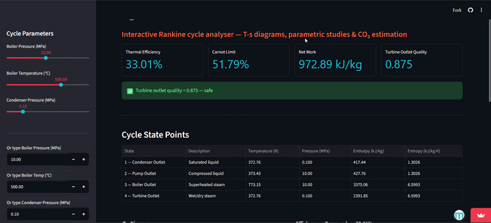

# 🔥 SteamLab


I built this during my first year summer break as an Energy Engineering student at IIT Delhi, Abu Dhabi. After covering the Rankine cycle in class, I wanted to go beyond the textbook. Instead of just solving problems on paper, I wanted to actually see how the cycle behaves when you change conditions in real time.

So I built SteamLab.

---

## What it does

You input boiler pressure, boiler temperature and condenser pressure either by dragging sliders or typing values directly. The app instantly updates:

- A live **T-s diagram** showing your cycle plotted against the steam saturation dome
- A **parametric study** comparing your cycle's efficiency against the Carnot limit across a range of pressures
- A **state points table** with enthalpy, entropy, temperature and pressure at all 4 cycle states
- A **turbine outlet quality warning** that flags blade damage risk if steam gets too wet
- A **CO₂ emissions estimate** based on your choice of fuel — coal, gas or nuclear

---

## 🎬 Demo



---

## Try it

👉 **[Open SteamLab](https://steamlab.streamlit.app/)**

Or run it locally:

```bash
git clone https://github.com/rithika747/steamlab.git
cd steamlab
pip install streamlit iapws plotly numpy pandas
streamlit run app1.py
```

---

## A note on the steam tables

Steam properties are calculated using the `iapws` library which implements the IAPWS-IF97 standard — the same international formulation used in professional power plant software. So the numbers are real, not approximations.

---

## Tech

Python · Streamlit · Plotly · iapws · NumPy · Pandas

---

## About me

I'm a first year Energy Engineering student at IIT Delhi, Abu Dhabi. I built this because I was curious, and because I think the best way to understand thermodynamics is to play with it.

[LinkedIn](https://in.linkedin.com/in/rithika-kappatan-35b631378) · [GitHub](https://github.com/rithika747)
